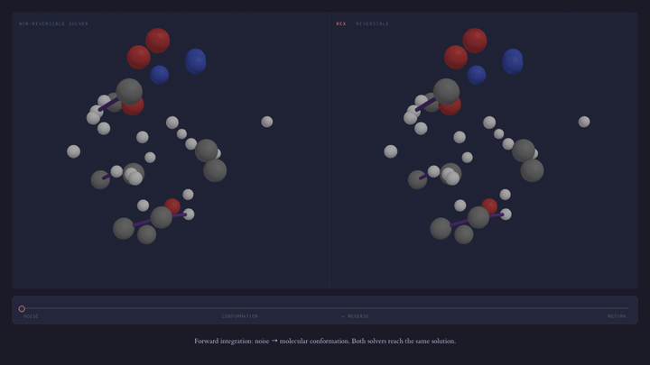

<div align="center">

# Rex: A Family of Reversible Exponential (Stochastic) Runge-Kutta Solvers

[](https://arxiv.org/abs/2502.08834)
[](https://openreview.net/forum?id=7pQIzVNctu)

<p>
    Zander W. Blasingame ·
    Chen Liu
</p>



</div>

---

## Contents

- [Overview](#overview)
- [Repository layout](#repository-layout)
- [Installation](#installation)
- [Quick start](#quick-start)
- [API](#api)
- [Reproducing the paper](#reproducing-the-paper)
- [Datasets](#datasets)
- [Evaluation](#evaluation)
- [Citation](#citation)
- [Acknowledgements](#acknowledgements)
- [License](#license)

---

## Overview

Rex (**R**eversible **Ex**ponential) is a family of algebraically reversible
solvers for diffusion models. Rex is constructed by applying Lawson's
exponential transformation to an explicit (stochastic) Runge–Kutta scheme and
then wrapping it in the McCallum–Foster reversible coupling. The result is a
solver that:

- is **exactly reversible** in finite-precision arithmetic (forward then
  backward returns the original state, up to floating-point error),
- **inherits the order of convergence** of the underlying RK scheme,
- works in both the **probability-flow ODE** and the **reverse-time SDE**
  settings,
- is a drop-in replacement for standard solvers used for sampling, inversion,
  editing, and interpolation with diffusion models.

This repository contains the reference implementation and the experiment
scripts used in the paper.

## Repository layout

```
Rex-solver/
├── LICENSE
├── README.md
├── requirements.txt
├── image-experiments/
│   ├── samplers/         # solver implementations
│   │   ├── rex.py        # RexTorchdynWrapper + legacy rex_forward/backward + ERK / ShARK
│   │   ├── rk_tableaus.py
│   │   ├── DDIM.py, BDIA.py, BELM.py, edict.py   # baselines
│   │   ├── test_sd15.py  # Stable-Diffusion 1.5 helpers
│   │   └── utils.py
│   ├── scripts/          # experiment drivers
│   │   ├── celeba.py             # §5.1 unconditional image generation (CelebA-HQ-256)
│   │   ├── sd_sampling.py        # §5.1 conditional generation (SD 1.5 + COCO)
│   │   ├── interpolate.py        # §5.3 image interpolation
│   │   ├── image_editing.py      # image-to-image editing (basic Rex driver)
│   │   ├── image_editing_rex.py  # image-to-image editing (RexTorchdynWrapper)
│   │   ├── inversion.py          # inversion / reconstruction studies
│   │   ├── reconstruction.py     # round-trip reconstruction error
│   │   └── ablations_rex.py      # ablation study (no_coupling / no_exp / no_reparam)
└── evaluations/  # clean-FID / PickScore / ImageReward / CLIP / LPIPS
```

## Installation

```bash
git clone https://github.com/zblasingame/Rex-solver.git
cd Rex-solver
python -m venv .venv && source .venv/bin/activate
pip install -r requirements.txt
```

PyTorch and CUDA versions should match your hardware. A GPU is required to
reproduce the Stable Diffusion experiments.

## Quick start

`RexTorchdynWrapper` takes a model that maps `(t, x) -> ε` (or `v`/`x₀`
depending on `model_type`) plus alpha/sigma closed forms, and exposes
`forward_solve` / `backward_solve` that are algebraic inverses of one
another:

```python
import torch
from diffusers import DDIMScheduler, StableDiffusionPipeline
from samplers.rex import create_rex_solver

sd = StableDiffusionPipeline.from_pretrained(
    "stable-diffusion-v1-5/stable-diffusion-v1-5", torch_dtype=torch.float32,
).to("cuda")
scheduler = DDIMScheduler(
    beta_start=0.00085, beta_end=0.012, beta_schedule="scaled_linear",
    clip_sample=False, timestep_spacing="linspace", set_alpha_to_one=False,
)

# A callable model(t, x) -> noise_pred. (CFG-aware wrappers live in
# scripts/inversion.py: SDRexModel, and scripts/image_editing_rex.py.)
def model(t, x):
    return sd.unet(x, 1000 * t, encoder_hidden_states=cond_embeds,
                   return_dict=False)[0]

solver = create_rex_solver(
    model, tableau="euler", n_steps=50, prediction_type="data", zeta=0.999,
    scheduler=scheduler, sched_type="scaled_linear",
)

encode_span = torch.tensor([2e-4, 1.0], device="cuda")
decode_span = encode_span.flip(0)
x, x_hat = latent.clone(), latent.clone()

# Encode: data -> noise
with torch.no_grad():
    xT, xT_hat = solver.backward_solve(x, x_hat, encode_span)
    # Decode: noise -> data (algebraic inverse on the same grid)
    x0, x0_hat = solver.forward_solve(xT, xT_hat, decode_span)

print((x0 - latent).abs().max())  # ≈ floating-point epsilon
```

For adaptive stepping pass `adaptive=True` together with an embedded
tableau (e.g. `dopri5`, `tsit5`, `fehlberg45`) and `step_domain ∈ {"t",
"varsigma"}` (default `"t"`). See `RexTorchdynWrapper.__init__` in
`samplers/rex.py` for the full set of knobs (`atol`, `rtol`,
`safety_factor`, `min_factor`, `max_factor`, `min_step`, `max_step`).

## API

All entry points live in `image-experiments/samplers/rex.py`.

| Symbol                              | Kind     | Purpose                                                                                 |
|-------------------------------------|----------|-----------------------------------------------------------------------------------------|
| `RexTorchdynWrapper`                | class    | Canonical Rex solver. Fixed-step + adaptive, VP + flow-matching, any Butcher tableau.   |
| `create_rex_solver`                 | factory  | Wires `RexTorchdynWrapper` to a diffusers VP scheduler (DDPM / Stable Diffusion).       |
| `psi`                               | function | The non-reversible exponential RK scheme on its own.                                    |
| `rex_forward`, `rex_backward`       | function | *Legacy* fixed-step API used by `sd_sampling.py`, `interpolate.py`, `image_editing.py`, `celeba.py`. New code should use `RexTorchdynWrapper`. |

### Butcher tableaus

Pass via `tableau=...` on `RexTorchdynWrapper` / `create_rex_solver`
(defined in `samplers/rk_tableaus.py`):

| Name               | Order | Stages | Embedded err. | Notes              |
|--------------------|:-----:|:------:|:-------------:|--------------------|
| `euler`            | 1     | 1      | —             |                    |
| `midpoint`         | 2     | 2      | —             |                    |
| `heun`             | 2     | 2      | —             |                    |
| `ralston`          | 2     | 2      | —             |                    |
| `ssprk3`           | 3     | 3      | —             | strong-stability   |
| `rk4`              | 4     | 4      | —             | classic            |
| `rk38`             | 4     | 4      | —             | 3/8-rule           |
| `bogacki_shampine` | 3     | 4      | yes (2)       | 3(2), FSAL         |
| `dopri5`           | 5     | 7      | yes (4)       | 5(4), FSAL         |
| `tsit5`            | 5     | 7      | yes (4)       | 5(4), FSAL         |
| `fehlberg45`       | 4     | 6      | yes (5)       | 4(5)               |

Embedded methods (last four rows) work with `adaptive=True`.

### Legacy solvers

Pass via the `solver=...` argument on `rex_forward` / `rex_backward`
(defined in `samplers/rex.py`):

| Name             | Order | SDE | Notes                       |
|------------------|:-----:|:---:|-----------------------------|
| `euler`          | 1     | —   | also exposed as a tableau   |
| `midpoint`       | 2     | —   | exponential midpoint        |
| `rk4`            | 4     | —   | exponential RK4             |
| `tsit5`          | 5     | —   | exponential Tsit5 (no err.) |
| `euler_maruyama` | 1     | yes |                             |
| `shark`          | 1.5   | yes | ShARK scheme                |

<details>
<summary>Legacy API example</summary>

```python
from samplers.rex import rex_forward, rex_backward
timesteps = torch.linspace(1.0, 2e-4, 51, device="cuda")
x0, x0_hat = rex_forward(model, scheduler, xt, xt_hat, timesteps,
                         solver="rk4", coupling=0.999)
xT, xT_hat = rex_backward(model, scheduler, x0, x0_hat, timesteps,
                          solver="rk4", coupling=0.999)
```

</details>

## Reproducing the paper

All experiment scripts must be run from `image-experiments/`. The
`run_*.sh` helpers in that directory are minimal worked examples; you will
typically want to script your own sweep over `--num_inference_steps` and
solvers.

<details>
<summary><b>Unconditional image generation</b> — CelebA-HQ-256, §5.1</summary>

Generates DDPM samples with the requested solver. `--sampler_type rex` enables
Rex; supported `--solver` values are `euler`, `midpoint`, `rk4`, `tsit5`,
`euler_maruyama`, `shark`. Baselines are selected via
`--sampler_type {ddim,bdia,edict,belm}`. See `image-experiments/run_rex.sh`
for a more complete example.

```bash
cd image-experiments
python scripts/celeba.py \
    --num_inference_steps 50 \
    --sampler_type rex \
    --solver rk4 \
    --pred_type data \
    --coupling 0.999 \
    --batch_size 64 \
    --test_num 80 \
    --device 0 \
    --save_dir results/uncond_gen/celeba/rex_rk4/50
```

</details>

<details>
<summary><b>Conditional image generation</b> — Stable Diffusion v1.5 + COCO, §5.1</summary>

```bash
cd image-experiments
python scripts/sd_sampling.py \
    --num_inference_steps 50 \
    --sampler_type rex \
    --solver midpoint \
    --guidance 5.5 \
    --device 0 \
    --save_dir results/cond_gen/sd15/rex_midpoint/50
```

</details>

<details>
<summary><b>Image-to-image editing</b></summary>

The richer driver `image_editing_rex.py` uses `RexTorchdynWrapper` and
supports all variants studied in the paper (`--tableau`, `--zeta`,
`--prediction_type`, optional `--adaptive` stepping). For the BDIA / EDICT /
DDIM / O-BELM baselines pass `--sampler_type {bdia,edict,ddim,belm}` to the
same script.

```bash
cd image-experiments
python scripts/image_editing_rex.py \
    --num_inference_steps 100 \
    --freeze_step 0.5 \
    --num_images 100 \
    --guidance 3.0 \
    --tableau euler \
    --zeta 0.999 \
    --prediction_type noise \
    --eps 0.0002 \
    --device 0 \
    --save_dir results/image_edits/rex_euler/100
```

</details>

<details>
<summary><b>Image interpolation</b> — FRLL, §5.3</summary>

```bash
cd image-experiments
python scripts/interpolate.py \
    --num_inference_steps 50 \
    --sampler_type rex \
    --solver shark \
    --device 0 \
    --save_dir results/interpolation/rex_shark/50
```

</details>

<details>
<summary><b>Ablations</b> — appendix</summary>

```bash
cd image-experiments
python scripts/ablations_rex.py \
    --num_inference_steps 84 \
    --freeze_step 0.6 \
    --num_images 100 \
    --guidance 3.0 \
    --tableau euler \
    --zeta 0.999 \
    --prediction_type noise \
    --eps 0.0002 \
    --variants full no_coupling no_exp no_reparam \
    --device 0 \
    --save_dir results/ablations/rex_euler/84
```

</details>

## Datasets

The experiments use the following datasets. None of them ship with this
repository — you must download them yourself and place them under
`image-experiments/data/`.

- **CelebA-HQ-256.** Used implicitly via the pretrained DDPM checkpoint
  [`google/ddpm-celebahq-256`](https://huggingface.co/google/ddpm-celebahq-256),
  which `scripts/celeba.py` downloads automatically the first time it
  runs. No manual download needed for the unconditional-generation
  experiment.
- **COCO captions.** `scripts/sd_sampling.py` reads prompts from
  `data/COCO_Captions.csv` — a CSV with one caption per line drawn from
  the MS-COCO 2014 validation captions. Any subset of the
  [COCO 2014 caption annotations](https://cocodataset.org/#download)
  works; the paper uses 1000 captions.
- **InstructPix2Pix (clip-filtered).** Used by
  `scripts/image_editing.py`, `scripts/image_editing_rex.py`,
  `scripts/inversion.py`, and `scripts/ablations_rex.py`. Download from
  HuggingFace and save to disk:

  ```python
  from datasets import load_dataset
  load_dataset("timbrooks/instructpix2pix-clip-filtered") \
      .save_to_disk("image-experiments/data/pix2pix")
  ```
- **FRLL (Face Research Lab London).** Used by `scripts/interpolate.py`,
  which expects raw images at `data/frll/`. Download the dataset from
  [figshare](https://figshare.com/articles/dataset/Face_Research_Lab_London_Set/5047666)
  and extract the images into that directory.

## Evaluation

The released evaluation utilities cover clean-FID and the editing metrics.

To evaluate released experiments:

```bash
# clean-FID
python evaluations/clean_fid_compute_stats.py <path-to-generated-images>

# One editing run (CLIPScore / PickScore / ImageReward / LPIPS)
python evaluations/editing.py <path-to-result-jsons> --max-samples 100

# Multiple seed directories: reports the per-seed values and mean ± sample std
python evaluations/editing.py <seed-1-jsons> <seed-2-jsons> <seed-3-jsons>
```

## Citation

```bibtex
@inproceedings{blasingame2026rex,
title={Rex: A Family of Reversible Exponential (Stochastic) Runge-Kutta Solvers},
author={Blasingame, Zander W. and Liu, Chen},
booktitle={Forty-third International Conference on Machine Learning},
year={2026},
url={https://openreview.net/forum?id=7pQIzVNctu}
}
```

## Acknowledgements

The experiment scaffolding for the diffusion-model baselines (BDIA, EDICT,
O-BELM, DDIM) is adapted from the official
[O-BELM repository](https://github.com/zituitui/BELM).
The McCallum–Foster reversible scheme that Rex builds on is from
[McCallum & Foster (2024)](https://arxiv.org/abs/2410.11648).

## License

Released under the [MIT License](LICENSE).
